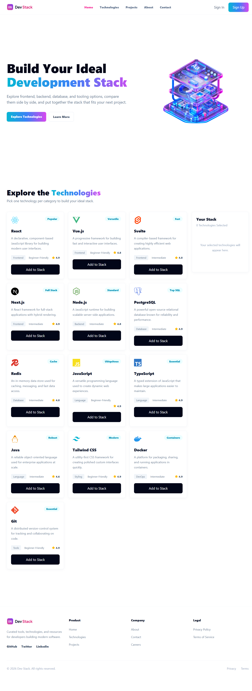

# Dev Stack Builder

Dev Stack Builder is a responsive React application for exploring development technologies and building a personalized technology stack. Users can browse technologies, add them to a stack, remove selections, and receive clear feedback through toast notifications.

## 🌐 Live Demo

[View the deployed project](https://dev-stack-brown-one.vercel.app/)

## 📸 Preview



## ✨ Features

- Responsive sticky navigation with a mobile menu
- Hero section with a shared cyan-to-blue-to-fuchsia brand gradient
- Technology data loaded from `public/technologies.json`
- Responsive technology grid: one column on mobile, two on tablet, and three on desktop
- Technology cards with category, difficulty, rating, badge, and icon details
- "Your Stack" panel for selected technologies
- Add, remove, and remove-all stack actions
- Duplicate-selection protection
- React-Toastify notifications with auto-close progress indicators
- Loading and error states for technology data
- Responsive footer and Vercel production deployment

## 🛠️ Tech Stack

- React 19
- TypeScript
- Vite
- Tailwind CSS 4
- React-Toastify
- Lucide React

## 🚀 Getting Started

### 📋 Prerequisites

- Node.js 20 or later
- npm

### 💻 Installation

```bash
git clone <your-repository-url>
cd dev-stack-builder-website
npm install
```

### ▶️ Run Locally

```bash
npm run dev
```

Open the local URL displayed by Vite, usually `http://localhost:5173`.

## 📜 Available Scripts

```bash
npm run dev       # Start the local development server
npm run build     # Type-check and build the production bundle
npm run preview   # Preview the production build locally
npm run lint      # Run ESLint
```

## 📂 Project Structure

```text
src/
  assets/          # Brand and hero images
  components/      # Reusable UI components
  types/           # TypeScript interfaces
  App.tsx          # Application composition
  index.css        # Global styles and shared brand theme
public/
  technologies.json # Technology data loaded by the application
```

## ▲ Deployment

The project is deployed on Vercel. Push changes to the `main` branch to trigger an automatic production deployment.

## 👤 Author

Sabbir Ahmed Samir

## ⚛️ Answering React Questions

i. JSX is basically Java Script XML. When we write HTML like code in JS is called JSX. We use JSX in React beacause it allows to write HTML like code in JS. This isn't mandatory to write JSX in React. But JSX provide Synthetic sugar to write React code easier and comfortable.

ii. Props are used to pass data from a parent component to a child component.
State is used to store and manage data inside a component that can change over time.

iii. useState is a React hook that allows us to create and update state in a functional component. I used it to store dynamic data like the selected stack, user inputs, and UI changes.

iv. useEffect is used to run side effects after a component renders. I used it to load the JSON data when the component first appeared, so the data was available to display in the application.

v. The key helps React identify each item in a list and update only the changed items efficiently. It also prevents rendering issues when the list changes.

vi. Conditional rendering means showing different UI based on a condition. For example, I used it to show an "empty stack" message when no items were selected, and show the stack items when data was available.

vii. A parent sends data to a child using props. A child can send data back by calling a function that the parent passes down as a prop.
